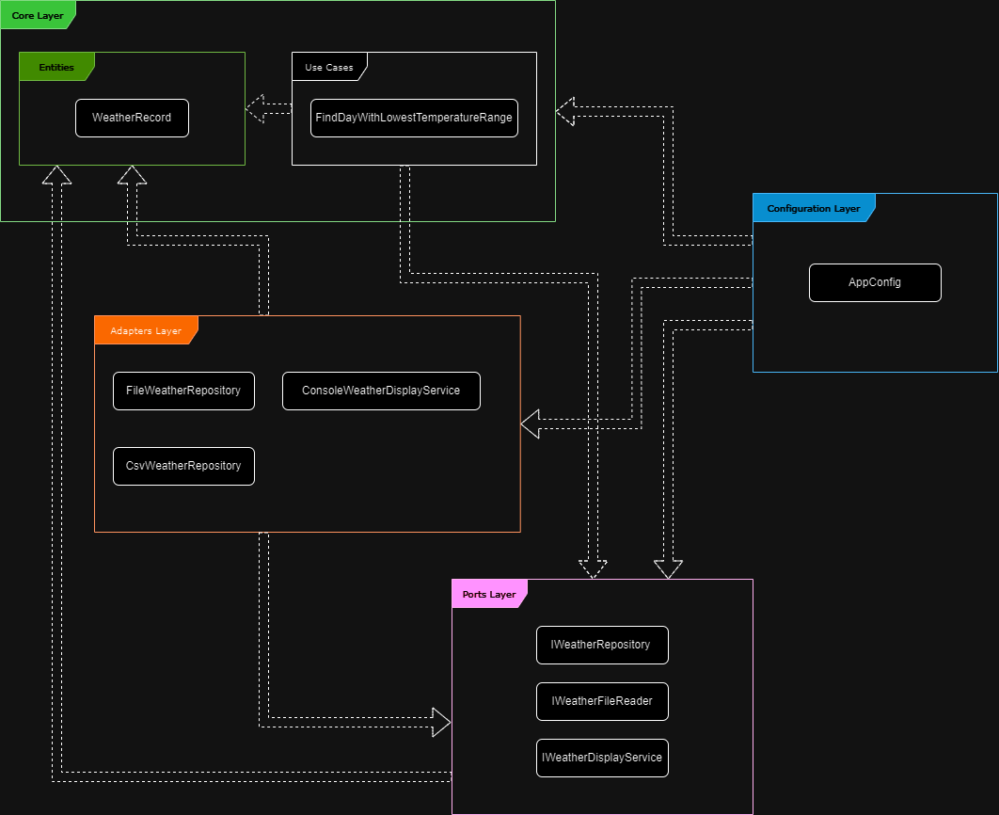

# Solution

This document proposes a solution to the challenge, detailing the necessary architectures, considerations and next steps.

The development process was divided into milestones for each part of the challenge, following Gitflow methods. Each milestone was merged into the main branch, which contains the complete solution.

For the working code of each milestone, please refer to [part-1-weather-challenge](https://github.com/gcadeado/programming-challenge/tree/part-1-weather-challenge) and [part-1-weather-challenge](https://github.com/gcadeado/programming-challenge/tree/part-2-countries-challenge).

# Architecture

For a simple Java application without a UI, with a focus on separation of concerns, 
a combination of Hexagonal Architecture and Clean Architecture would be ideal. 
Each layer has a specific role and does not depend on the details of other layers, 
promoting high cohesion and low coupling while following S.O.L.I.D. principles. 
This approach improves readability, maintainability, and testability by 
making the business rules independent of frameworks and other external elements.

## Layers
### Core (Domain)

Contains the domain entities and use cases, ensuring that the business logic is isolated and independent.

#### Entities

Entities are the core business objects.

#### Use Cases (Interactors)

Use Cases are the application-specific business rules.

### Ports

Interfaces for external systems (e.g., repository interfaces, service interfaces), 
enforcing a clear contract between the core and the external systems.
### Adapters

Actual implementations of the interfaces defined in the ports.
These could include repositories (for data access), external service clients, etc.

### Configuration

The application entry point. Manages dependency injection and application configuration logic.

## Architecture Diagram

The architecture diagram illustrates the layered structure of the application,
highlighting the separation of concerns (layer) and the flow of dependencies.

# Other used architectures and patterns
- Builder Pattern with Generics - CsvFileReader and it's derived classes
- Strategy Pattern - CsvFileReader with IFileReader interface

# Other used libraries
- OpenCsv due to ease-of-use and to customize and extend, providing robust parsing, in addition to JavaBean integrations
- Mockito for managing dependencies and mocking external interactions

# Next steps

- Validate required headers and create necessary tests
- Add more validations for read data (e.g. date and temperature ranges)
- Fix OpenCsv's exceptions from concurrent threads in tests
